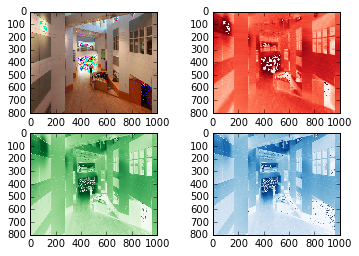
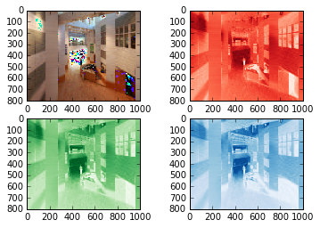

UECM3033 Assignment #2 Report
========================================================

- Prepared by: Lee Hui Zhong
- Tutorial Group: T2 

--------------------------------------------------------

## Task 1 --  $LU$ Factorization or SOR method

The reports, codes and supporting documents are to be uploaded to Github at: 

https://github.com/Huizhonglee/UECM3033_assign2

Explain your selection criteria here.
The condition of SOR method is Matrix must be positive definite so it will only convergence. However, a matrix is positive definite if all the eigenvalues of matrix are positive.

Explain how you implement your `task1.py` here.
At first, I used self-defined functions to solve the question. Two methods used to solve the problem is LU factorisation and Successive Over-relaxation(SOR) method.For SOR method, I used ?a formula based on convergence theorem to determine optimal¦Ø. A positive ¦Ø can help us to get convergence. SOR method can convergence only when 0< ¦Ø<2. The SOR method will reduce to the Gauss Seidel method when ¦Ø=1. With 0< ¦Ø<1, it called as under-relaxation methods while ¦Ø >1 called as over relaxation methods. So, we can choose ¦Ø between 1 and 2. For certain problems, SOR method will be very effective. ¡°np.linalg.solve(A,b)¡± function is used to solve linear equation and computes a ¡°exact¡± solution.Both linear systems solved by using LU factorisation.The answer for 1st linear system will be [1 1 1]. For the 2nd linear system is [ 1.  -1.   4.  -3.5  7.  -1. ]. These answers had checked by using online matrix calculator. The answers obtained are same for both linear systems.

---------------------------------------------------------

## Task 2 -- SVD method and image compression

Put here your picture file (photo1.tiff)

How many non zero element in $\Sigma$? All elements which are 800 in $\Sigma$ is non zero

Put here your lower and better resolution pictures. Explain how you generate
these pictures from `task2.py`.
Lower resolution picture (photo1_200.png)

Better resolution picture.(photo1_30.png)

Firstly, read the¡°photo1.tiff¡±picture and save it as img.Then,U, Sigma and V of three colour matrices can be find using linalg.svd function. Three zero matrices are created by using np.zeros_like function and keep the first 30 non zero elements into each of the matrices.  To get a new matrix, I use dot product to multiply new matrices S_red_new with another 2 red U,V matrix. Do the same for another 2 colour. A lower resolution image is produced. The steps above are repeated to get 200 better resolution picture.

What is a sparse matrix?
A matrix in which numbers of zero entries are much higher than the number of non-zero entries is called sparse matrix. Sparse matrices are stored using special data structure. Sparse matrix has small number of non-zero entries. These non-zeros encode connectivity such as Hyperlinks, Social Network and so on. 
 
-----------------------------------

last modified: 11/3/2016
